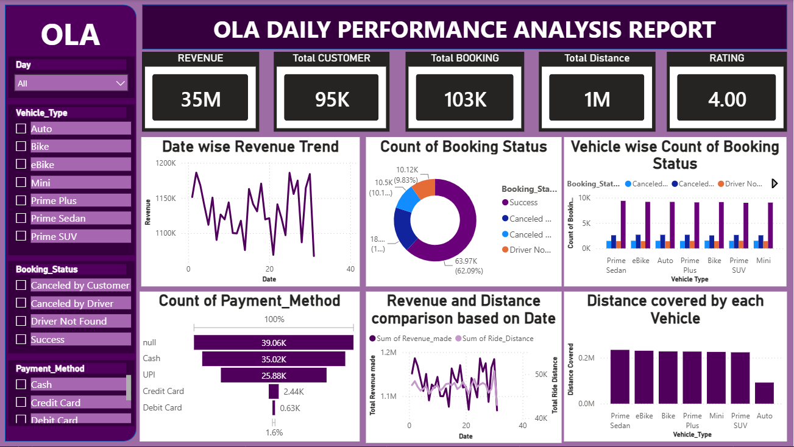

# 🚖 OLA Daily Performance Analysis Project

A comprehensive **Power BI Business Intelligence project** that analyzes OLA ride booking data to uncover insights into revenue, booking performance, ride cancellations, customer satisfaction, payment methods, and vehicle performance. The project transforms raw ride-booking data into an interactive dashboard that supports data-driven business decisions.

---

## 📌 Project Overview

This project analyzes one month of OLA ride booking data to understand business performance across multiple dimensions, including revenue generation, booking status, customer ratings, ride distance, payment methods, and vehicle-wise performance.

Using **Power BI**, the raw dataset was cleaned, modeled, and transformed into an interactive dashboard that enables stakeholders to monitor key business metrics and identify opportunities for operational improvement.

---

## 🎯 Business Objectives

* Analyze overall booking performance.
* Track daily revenue trends.
* Identify the most profitable vehicle categories.
* Monitor booking success and cancellation rates.
* Evaluate customer satisfaction through ratings.
* Analyze ride distance across vehicle types.
* Understand customer payment preferences.
* Support business decisions using interactive visualizations.

---

# 🛠️ Tools & Technologies

* **Power BI Desktop**
* **Power Query**
* **DAX (Data Analysis Expressions)**
* **Microsoft Excel / CSV**
* **Data Modeling**
* **Data Visualization**

---

# 📂 Dataset

The dataset contains OLA ride booking information including:

* Booking Date
* Vehicle Type
* Booking Status
* Revenue
* Ride Distance
* Payment Method
* Customer Rating
* Ride Cancellation Details
* Driver Availability

---

# 📊 Dashboard Features

The dashboard includes interactive reports for:

* 📈 Daily Revenue Analysis
* 💰 Total Revenue
* 📅 Booking Trend
* 🚖 Vehicle-wise Revenue
* 📊 Booking Status Analysis
* ❌ Customer Cancellation Analysis
* 🚫 Driver Cancellation Analysis
* 📏 Vehicle-wise Ride Distance
* ⭐ Customer Rating Analysis
* 💳 Payment Method Distribution

---

# 📌 Key Performance Indicators (KPIs)

* 💰 Total Revenue
* 🚖 Total Bookings
* 👥 Total Customers
* ⭐ Average Customer Rating
* 📏 Total Ride Distance

---

# 📈 Key Insights

## 💰 Revenue Analysis

* Total Revenue generated: **₹35,080,467**
* Revenue remained relatively consistent throughout July, with slight fluctuations in daily bookings.

---

## 🚖 Vehicle Performance

### Highest Revenue

* **Prime Sedan** generated the highest revenue.

### Lowest Revenue

* **Prime SUV** generated the lowest revenue among all vehicle categories.

---

## 📋 Booking Status

Total bookings were categorized as:

* Successful Rides
* Driver Not Found
* Cancelled by Driver
* Cancelled by Customer

The majority of bookings were completed successfully, while a smaller percentage were cancelled due to customer decisions or driver unavailability.

---

## 🚗 Successful Rides

* Prime Sedan recorded the highest number of successful rides.
* Prime SUV recorded the lowest number of successful rides.

---

## ❌ Driver Availability

* Prime SUV experienced the highest number of rides cancelled because drivers were unavailable.
* Auto experienced the lowest number of "Driver Not Found" cases.

---

## 🚫 Driver Cancellations

Driver cancellations were highest for **eBike** rides.

---

## 👤 Customer Cancellations

Customer cancellations were highest for **Bike** bookings.

---

## 📏 Ride Distance

* Prime Sedan covered the highest total ride distance.
* Auto covered the lowest total ride distance.

---

## 💳 Payment Analysis

Most customers preferred:

1. Cash
2. UPI
3. Credit Card
4. Debit Card

Cash and UPI together accounted for the majority of all ride payments.

---

## ⭐ Customer Ratings

Customer ratings remained consistent across vehicle categories, with average ratings around **4.0**, indicating a generally positive customer experience.

---

# 💡 Business Recommendations

* Increase the availability of Prime SUV drivers to reduce booking failures.
* Investigate the reasons behind frequent driver cancellations for eBike rides.
* Improve customer retention strategies to reduce customer cancellations.
* Promote digital payment methods through cashback and promotional offers.
* Expand the Prime Sedan fleet since it generates the highest revenue and ride volume.
* Continuously monitor daily booking trends to optimize fleet allocation and driver availability.

---

# 📁 Repository Structure

```text
OLA-Ride-Booking-Analysis/
│
├── ola project dashboard.pbix
├── ola_data.csv
├── OLA project report.pdf
├── Images/
│   └── Dashboard.png
└── README.md
```

---

# 🚀 Skills Demonstrated

* Data Cleaning
* Data Transformation
* Data Modeling
* DAX Measures
* Power Query
* Interactive Dashboard Development
* KPI Design
* Business Intelligence
* Data Visualization
* Business Analysis
* Storytelling with Data

---

# 📷 Dashboard Preview

> 

---

# 📊 Business Value

This dashboard enables stakeholders to:

* Monitor business performance in real time.
* Identify high-performing vehicle categories.
* Reduce booking failures and ride cancellations.
* Improve operational efficiency.
* Optimize fleet allocation.
* Enhance customer satisfaction.
* Support strategic business decisions using data.

---

## 👨‍💻 Author

**Aman Kumar**

* GitHub: https://github.com/amanviratian-creator
* LinkedIn: (www.linkedin.com/in/aman-kumar-mus)

If you found this project useful, consider giving it a ⭐ on GitHub!
